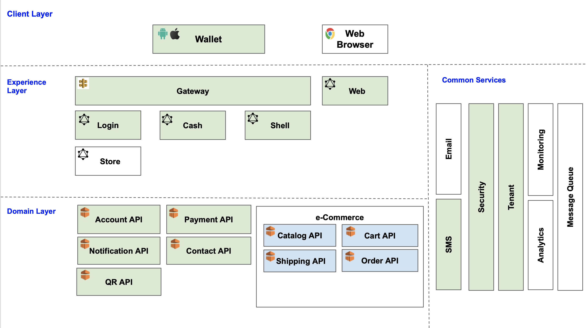

# Wutsi
<kbd></kbd>

| Application                                                               | Status                                                                                         | Version                                                                  | Details                                                                                                                                     |
|---------------------------------------------------------------------------|------------------------------------------------------------------------------------------------|--------------------------------------------------------------------------|---------------------------------------------------------------------------------------------------------------------------------------------|
| **Client Layer**                                                          |
| [wutsi_wallet](https://github.com/wutsi/wutsi_wallet)                     |               |                                                                          |                                                                                                                                             |
| **Experience Layer**                                                      |
| [Gateway](https://github.com/wutsi/wutsi-gateway)                         |              |                                                                          | API Gateway                                                                                                                                 |
| [Login BFF](https://github.com/wutsi/wutsi-login-bff)                     |            |                                                                          |                                                                                                                                             |
| [Shell BFF](https://github.com/wutsi/wutsi-shell-bff)                     |            |                                                                          |                                                                                                                                             |
| [Cash BFF](https://github.com/wutsi/wutsi-cash-bff)                       |             |                                                                          |                                                                                                                                             |
| [Store BFF](https://github.com/wutsi/wutsi-store-bff)                     |            |                                                                          |                                                                                                                                             |
| [Web](https://github.com/wutsi/wutsi-web)                                 |                  |                                                                          | Wutsi Web App                                                                                                                               |
| **Domain Layer**                                                          |
| [Account API](https://github.com/wutsi/wutsi-account-server)              |       |   | [API](https://wutsi.github.io/wutsi-account-server/api/)                                                                                    |
| [Payment API](https://github.com/wutsi/wutsi-payment-server)              |       |   | [API](https://wutsi.github.io/wutsi-payment-server/api/)                                                                                    |
| [Contact API](https://github.com/wutsi/wutsi-contact-server)              |       |   | [API](https://wutsi.github.io/wutsi-contact-server/api/)                                                                                    |
| [Notification API](https://github.com/wutsi/wutsi-notification-server)    |  |                                                                          | Send notifications to users via SMS                                                                                                         |
| [Catalog API](https://github.com/wutsi/wutsi-catalog-server)              |       |   | [API](https://wutsi.github.io/wutsi-catalog-server/api/)                                                                                    |
| [Cart API](https://github.com/wutsi/wutsi-cart-server)                    |          |      | [API](https://wutsi.github.io/wutsi-cart-server/api/)                                                                                       |
| **Common Services**                                                       |
| [Tenant](https://github.com/wutsi/wutsi-tenant-server)                    |        |    | [API](https://wutsi.github.io/wutsi-tenant-server/api/) - Provide support for multi-tenancy                                                 |
| [Security](https://github.com/wutsi/wutsi-security-server)                |      |  | [API](https://wutsi.github.io/wutsi-security-server/api/) - Manages the platform security. Provides authentication, authorization, keystore |
| [SMS](https://github.com/wutsi/wutsi-sms-server)                          |           |       | [API](https://wutsi.github.io/wutsi-sms-server/api/)                                                                                        |
| [Mail](https://github.com/wutsi/wutsi-mail-server)                        |          |      | [API](https://wutsi.github.io/wutsi-mail-server/api/)                                                                                       |
| [Analytics](https://console.firebase.google.com)                          |                                                                                                |                                                                          | Collects all the platform signals using [Google Firebase](https://console.firebase.google.com/) (Analytics, Crashlytics)                    |
| Monitoring                                                                |                                                                                                |                                                                          | Monitors the platform                                                                                                                       |
| Message Queue                                                             |                                                                                                |                                                                          | RabbitMQ as message bus                                                                                                                     |
| **Core Libraries**                                                        |
| [sdui](https://github.com/wutsi/sdui)                                     |                       |                                | Flutter Server Driven UI library                                                                                                            |
| [sdui-kotlin](https://github.com/wutsi/sdui-kotlin)                       |                |            | Server Driven UI kotlin binding                                                                                                             |
| [wutsi-shared-ui](https://github.com/wutsi/wutsi-shared-ui)               |            |        | Common reusable UI components                                                                                                               |
| [wutsi-platform-payment](https://github.com/wutsi/wutsi-platform-payment) |     |     | Payment library for mobile payments (MTN, OM etc.)                                                                                          |
| [wutsi-platform-core](https://github.com/wutsi/wutsi-platform-core)       |        |        |                                                                                                                                             |
| [wutsi-openapi](https://github.com/wutsi/wutsi-openapi)                   |                                                                                                |                                                                          | API in OpenAPI schemas                                                                                                                      |
| [wutsi-codegen](https://github.com/wutsi/wutsi-codegen)                   |              |              | OpenAPI to Kotlin code generateor                                                                                                           |
| **Dev Tools**                                                             |
| [wutsi_devtools](https://github.com/wutsi/wutsi_devtools)                 |             |                                                                          |                                                                                                                                             |

## Important Architectural Patterns
- [An Introduction to Micro Services](https://medium.com/microservicegeeks/an-introduction-to-microservices-a3a7e2297ee0)
- [The BFF Pattern (Backend for Frontend): An Introduction](https://blog.bitsrc.io/bff-pattern-backend-for-frontend-an-introduction-e4fa965128bf)
- [What is Server Driven UI](https://www.judo.app/blog/server-driven-ui/)

## Important Links
- Test Environment
  - [Firebase Analytics](https://console.firebase.google.com/u/0/project/wutsi-wallet-int/analytics/app/android:com.wutsi/overview/~2F%3Ft%3D1637862176262&fpn%3D4026312901&swu%3D1&sgu%3D1&sus%3Dupgraded&cs%3Dapp.m.dashboard.overview&g%3D1)
  - [Firebase Crashlytics](https://console.firebase.google.com/u/0/project/wutsi-wallet-int/crashlytics/app/android:com.wutsi/issues?state=open&time=last-seven-days&type=all&tag=all)
  - [Firebase Performance](https://console.firebase.google.com/u/1/project/wutsi-wallet-int/performance/app/android:com.wutsi/trends)
  
- Prod Environment
