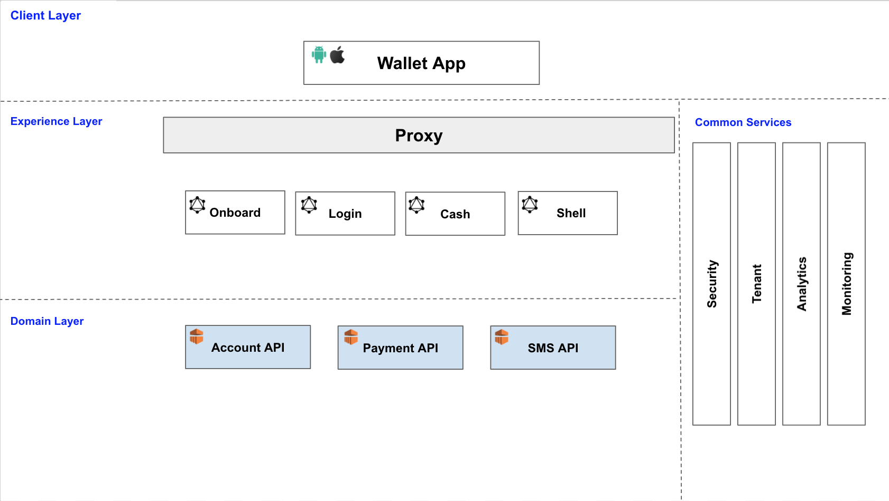

# Wutsi Architecture
<kbd></kbd>

| Application | Version | Details |
|-------------|---------|-------------|
|[wutsi-wallet](https://github.com/wutsi/wutsi_wallet) |  |  |
|[Tenant API](https://github.com/wutsi/wutsi-tenant-server)|  | [API](https://wutsi.github.io/wutsi-tenant-server/api/)|
|[Security API](https://github.com/wutsi/wutsi-security-server)|  | [API](https://wutsi.github.io/wutsi-security-server/api/)|
